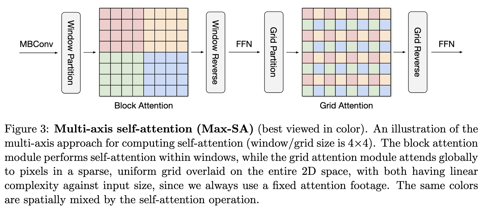

# trt2022
trt2022比赛，银河飞车队的仓库

---
## 总述
本次比赛我们选择优化的模型是[MaxViT](https://arxiv.org/pdf/2204.01697.pdf), 其 unoffical implemention 在[这里](https://github.com/ChristophReich1996/MaxViT)。
## 原始模型
### 模型简介
MaxViT(Multi-axis Vision Transformer), 是 Google Research and University of Texas at Austin 在 2022 年提出的一个 ViT(Vision Transformer) 模型，
相比于传统的 ViT 模型，其主要的创新点是引入了 Multi-axis Attention 机制，包括 blocked local and dilated global attention 两部分。

其网络结构保持了传统 CNN 的简洁性

在图像分类任务上取得了 state of the art 的效果，而且其作为 backbone 也可以应用到 CV 的多个 Task 中。

### 模型优化的难点
1. Multi-axis Attention 需要实现 plugin 以提高性能。
2. 模型搭建需要两个步骤，Pytorch -> ONNX -> TensorRT，可能转换失败或者引入多余的胶水OP，需要图优化策略。
3. 应用 fp16 和 int8 post train quant。
4. 作为 backbone 测试 CV 其他 task。

